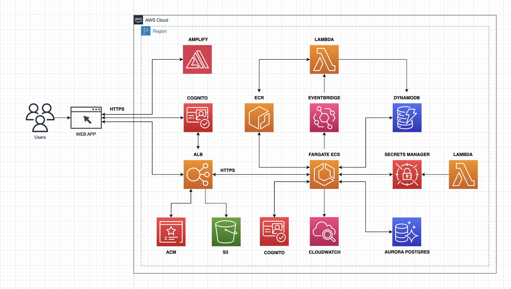
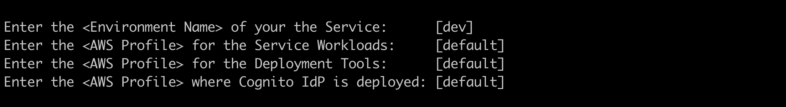
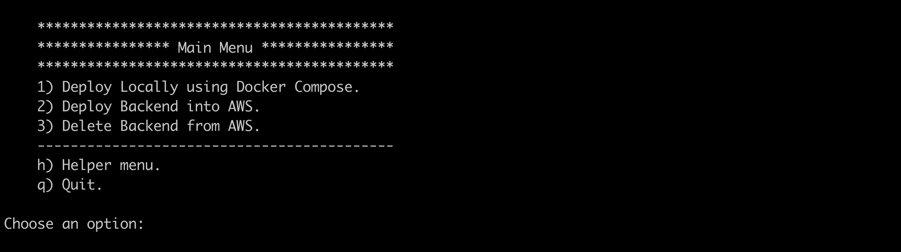

## EDA using Spring Boot and Spring Cloud Functions to deploy native executables on ECS and Lambda respectively.

* **Author**: [Andres Solorzano](https://www.linkedin.com/in/aosolorzano/).
* **Level**: 400 - Advanced.
* **Technologies**: Java 17, Spring Boot 3, Spring Cloud 4, Spring Native, Spring WebFlux, Spring OAuth2, Quartz, Flyway, Lombok, Docker, Testcontainers, LocalStack, AWS Copilot CLI, AWS SAM-CLI, Amazon Cognito, Amazon Aurora, DynamoDB, Application Load Balancer, EventBridge, Lambda, and Amplify.



You can read the following articles from my **Medium.com** account to get more project details:

1. [Multi-Account environment on AWS using IAM Identity Center](https://aosolorzano.medium.com/implementing-a-multi-account-environment-with-aws-organizations-and-the-iam-identity-center-d1cdb40bdf4d).
2. [End-to-End Encryption using TLS ECDSA certificate and ACM with Copilot CLI](https://aosolorzano.medium.com/end-to-end-encryption-using-tls-ecdsa-certificate-acm-and-aws-copilot-cli-64f5daafe977).
3. [EDA using Amazon EventBridge, Lambda, and SAM-CLI, with Fargate ECS as Event Source](https://aosolorzano.medium.com/eda-with-eventbridge-and-lambda-using-sam-cli-with-spring-boot-ms-on-fargate-ecs-as-event-source-9abee237be08).
4. [Storing EDA events in DynamoDB from a Native Lambda Function using Spring Cloud Functions](https://aosolorzano.medium.com/storing-eda-events-in-dynamodb-using-a-native-lambda-function-with-graalvm-spring-cloud-functions-c32cee4775fc).
5. [FullStack application on AWS using Ionic/Angular Frameworks inside an Nx Monorepo with PNPM and Amplify](https://aosolorzano.medium.com/fullstack-app-on-aws-using-ionic-angular-frameworks-inside-an-nx-monorepo-with-pnpn-and-amplify-588e124452e4).


## Description.
This project uses Spring Boot to manage Quartz Jobs with the help of Spring Webflux and Spring Native.
The Quartz library is configured for a clustered environment, so it needs Postgres to store and manage Jobs executions.
When a Quartz Job is executed, the calling method retrieves the Device item associated with the Tasks and updates its state in DynamoDB.
To perform all these activities, the users must have a valid access token (JWT) to access the endpoints.
All test cases use TDD from the beginning of the development, and only Integration Tests are executed with the support of Testcontainers and LocalStack to try to cover real-world scenarios.
This project also uses Docker Compose to deploy a local cluster with the required services for local testing.


## Prerequisites.
- Git.
- NodeJS (version 18.+).
- Nx CLI (version 17.+).
- PNPM (version 8.11.+).
- AWS Copilot CLI (version 1.27.+).
- AWS SAM CLI (version 1.90.+).
- OpenJDK (version 17.0.+). You can use SDKMAN.
- Apache Maven (version 3.9.+) You can use SDKMAN.
- Spring Boot (version 3.1.+).
- Spring Functions (version 4.0.+).
- Docker and Docker Compose (version 24.0.+).


## Project Structure.
The project is divided into the following files/directories:
- **apis**: Back-end source code.
- **apps**: Front-end source code.
- **copilot**: AWS Copilot configuration files.
- **template.yaml**: AWS SAM configuration.
- **compose.yaml**: Docker Compose configuration.
- **pom.xml**: Java projects parent POM.
- **tools**: Files used for automation deployment.


## Deployment Options.
You need to execute the following command from the project's root directory:
```bash
./run-scripts.sh
```

The script will ask you for the required AWS profiles to deploy the application locally or in AWS:


Then, the script shows a main menu with the following options:


If you choose option 'h' for 'Helper Menu,'
you can create/deploy dependent resources required before deploying the application on AWS.


## Internal Documentation.
The internal project documentation is divided into the following directories:
- **apis/city-events-function**: Contains Spring Functions project's documentation.
- **apis/city-tasks-api**: Contains Spring Boot project's documentation.
- **apps/city-tasks-app**: Contains Ionic/Angular project's documentation.
- **docs/images**: Contains solution's architecture images.

The markdown documentation for individual projects is available at:
- [Tasks API with AWS Copilot CLI](apis/city-tasks-api/README.md).
- [Tasks Event with AWS SAM CLI](apis/city-events-function/README.md).
- [Tasks APP with Ionic/Angular frameworks](apis/city-events-function/README.md).
